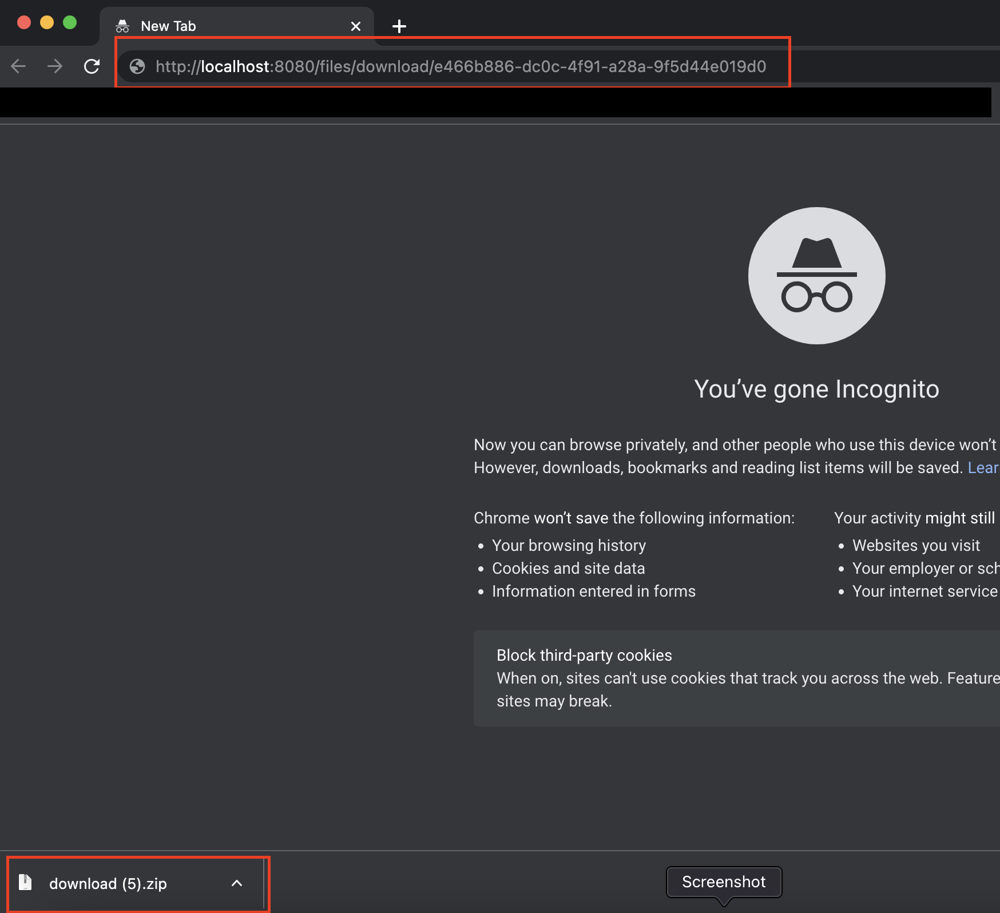
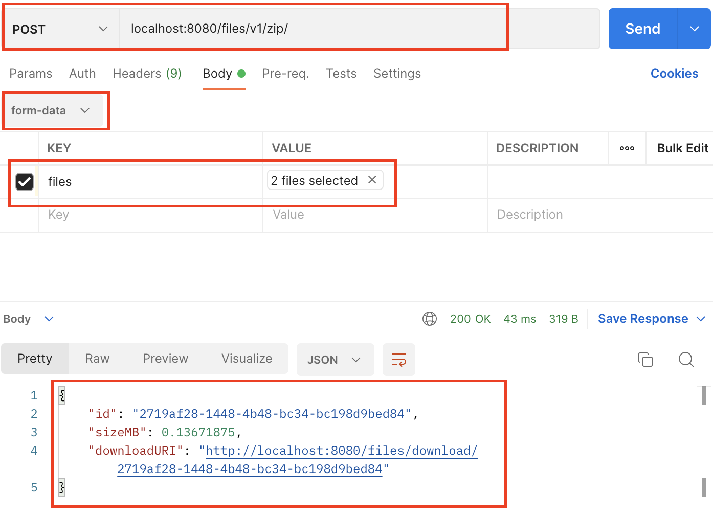
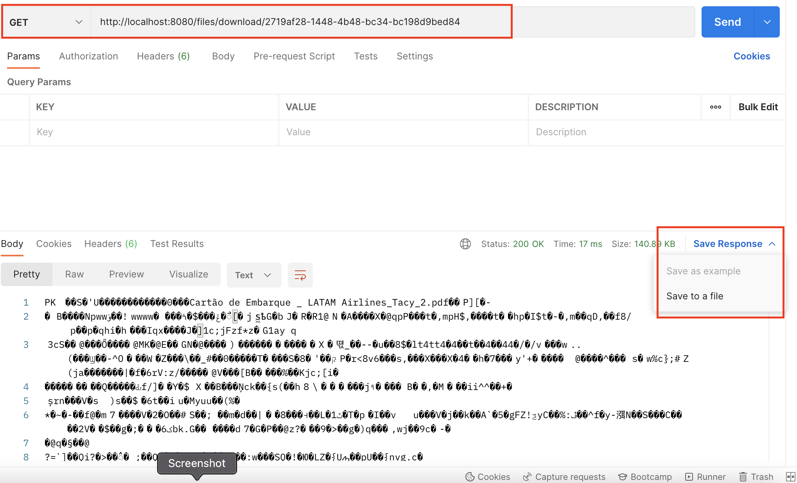

# Vercator Technical Task

## Zip API
This microservice is responsible to zip a list of files

### Prerequisites

> [Java 8](https://www.oracle.com/java/technologies/downloads/)

> [Maven 3.8.5](https://maven.apache.org/download.cgi)

> [Docker](https://docs.docker.com/get-docker/)

### Package the application
```
./mvnw package
```

### Building the image
```
docker build -t vercator/zip-api .
```
### Running the application
```
docker run -p 8080:8080 -t vercator/zip-api
```

### HealthCheck
```
http://localhost:8080/files/v1/health
```


### Testing

#### Using Curl
| Parameter |         Description         |             Value              |
|-----------|:---------------------------:|:------------------------------:|
| method    |         Http method         |              POST              |
| output    | Destination for zipped file |          download.zip          |
| request   |       Destination URL       | localhost:8080/files/v1/zip/   |
| form      |        List of files        |                                |

Request
```
curl --location --request POST 'localhost:8080/files/v1/zip/' \
--form 'files=@"/Users/humberto.carvalho.br/FILE1.pdf"'
--form 'files=@"/Users/humberto.carvalho.br/FILE2.txt"'
```
Response - JSON Object with the URL for download the zip file
```json
{
    "id": "e466b886-dc0c-4f91-a28a-9f5d44e019d0",
    "sizeMB": 0.068359375,
    "downloadURI": "http://localhost:8080/files/v1/download/e466b886-dc0c-4f91-a28a-9f5d44e019d0"
}
```
After that copy the URL in your browser and download the zip file



#### Using Postman
| Parameter |   Description   |            Value             |
|-----------|:---------------:|:----------------------------:|
| method    |   Http method   |      POST                    |
| URL       | Destination URL | localhost:8080/files/v1/zip/ |
| body      |      type       |          form-data           |
| key       |    parameter    |            files             |
| value     | selected files  | selected files from your OS  |

Request


Response
```json
{
    "id": "e466b886-dc0c-4f91-a28a-9f5d44e019d0",
    "sizeMB": 0.068359375,
    "downloadURI": "http://localhost:8080/files/v1/download/e466b886-dc0c-4f91-a28a-9f5d44e019d0"
}
```
Click in the downloadURI link  and do another request

After the request you need to save the response as a file

